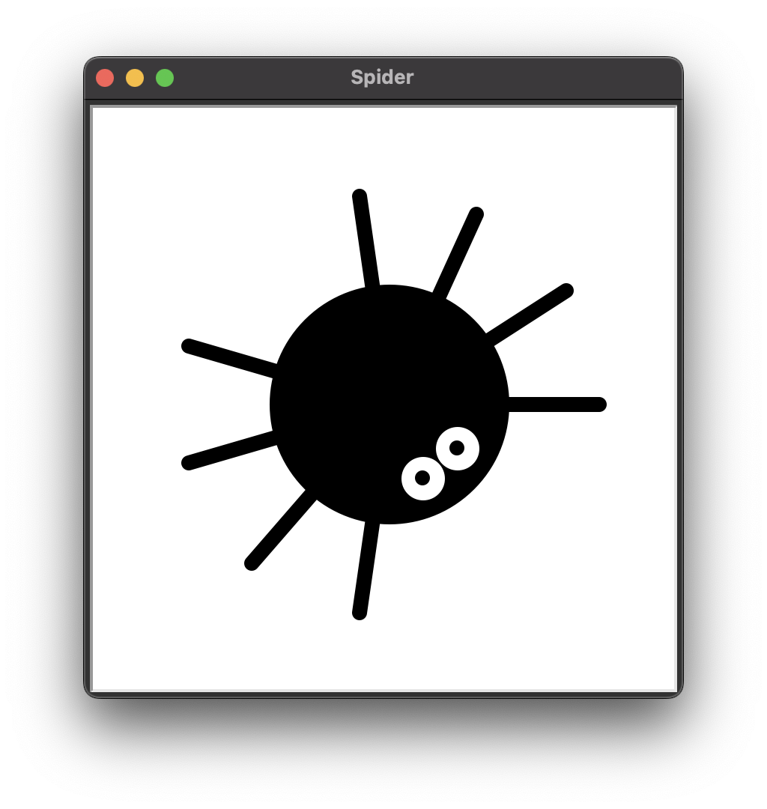

# Spider Drawing with Python's `turtle`
This is a very basic script to draw a spider with Python's [`turtle`](https://docs.python.org/3/library/turtle.html) graphics module.

The rendered drawing is used as [my profile](https://github.com/superatomic) image.

## Output

  <!-- Their name is Billie -->

## Installation

### Download the source
Pick any method to install the source files or just [download the source files as a ZIP](https://github.com/superatomic/spider/archive/refs/heads/main.zip).

- Git
  ```shell
  git clone https://github.com/superatomic/spider.git
  ```
- Github CLI
  ```shell
  gh repo clone superatomic/spider
  ```
  
### Running the program

Simply run the program with `python3 main.py` to draw the spider.
This program has been verified to work on Python 3.7+, and may or may not work on lower versions.

<!-- Thanks to https://stackoverflow.com/questions/58737436/ -->
| :heavy_exclamation_mark: | Your Python installation must support [`tkinter`](https://docs.python.org/3/library/tkinter.html) for the program to run! |
|--------------------------|:--------------------------------------------------------------------------------------------------------------------------|

## That's it!

Hopefully this program is useful to somebody someday. I certainly had fun writing it.

